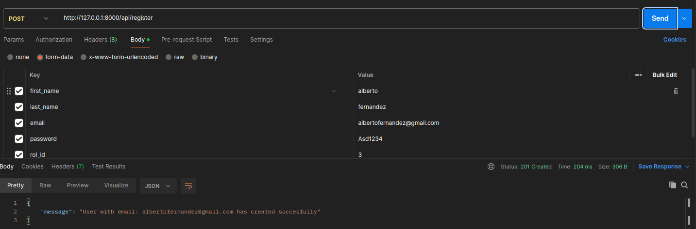
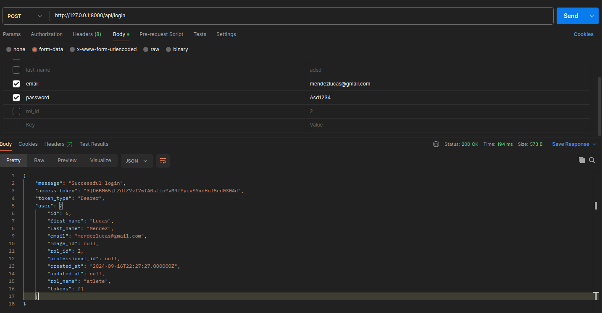
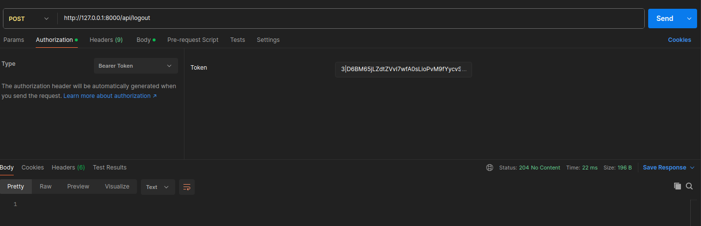

# Documentacion de la API de Aragoge
Se mencionaran todos los endpoint con los parametros requeridos u acceptados para cada uno de ellos asi como tambien los requisitos como autenticacion u otras cosas./

> [!IMPORTANT]
>
> En las rutas protegidas no olvidarse de enviar el header "Accept" con el valor "application/json" en caso contrario te tirara un error de login.
> Con la cabecera Accept: application/json, te saldrá el error apropiado y además ya en formato JSON. En caso contrario, te sale esto:  "Route [login] not defined" porque Laravel por defecto cree que estas utilizando la autenticación nativa del framework y por defecto te va a redirigir a la ruta /login (cosa que no existe si no instalaste el paquete UI de laravel) y por eso salta esa excepción.

## Endpoint raiz
Actualmente retorna un 404 ya que no existe posteriormente devolvera la documentacion.
`http://127.0.0.1:8000/api/`

## Obtener roles
Los roles se pueden obtener desde dos rutas:
1. `http://127.0.0.1:8000/api/roles`: Esta ruta devolvera todas las rutas que esten guardadas en la base de datos.
    - **Method**: GET

    **Ejemplo**:
    ``` JSON
    {
    "data": [
        {
        "id": 1,
        "name": "admin",
        "created_at": "2024-09-16T22:27:26.000000Z",
        "updated_at": null
        },
        {
        "id": 2,
        "name": "atlete",
        "created_at": "2024-09-16T22:27:26.000000Z",
        "updated_at": null
        },
        {
        "id": 3,
        "name": "professional",
        "created_at": "2024-09-16T22:27:26.000000Z",
        "updated_at": null
        }
    ],
    "status_code": 200
    }  
    ```
2. `http://127.0.0.1:8000/api/roles/<id-rol>`: Esta ruta devolvera el rol que coincida con el id que le pasamos en la ruta, si este rol no existe devolvera un 404.
    - **Method**: GET

    **Ejemplo**:
    ``` JSON
    {
    "data": [
        {
        "id": 1,
        "name": "admin",
        "created_at": "2024-09-16T22:27:26.000000Z",
        "updated_at": null
        }
    ],
    "status_code": 200
    }  
    ```

## Obtener Categorias
Las categorias se pueden obtener desde dos rutas:
1. `http://127.0.0.1:8000/api/categories`: Este enpoint devolvera todas las categorias que esten guardadas en la base de datos.
    - **Method**: GET

    **Ejemplo**:
    ``` JSON
    {
    "data": [
       {
      "id": 1,
      "name": "powerlifting",
      "created_at": "2024-09-16T22:27:27.000000Z",
      "updated_at": null
    },
    {
      "id": 2,
      "name": "crossfit",
      "created_at": "2024-09-16T22:27:27.000000Z",
      "updated_at": null
    },
    // ...
    ],
    "status_code": 200
    }  
    ```
2. `http://127.0.0.1:8000/api/categories/<id-category>`: Esta ruta devolvera la categoria que coincida con el id que le pasamos en la ruta, si esta categoria no existe devolvera un 404.
    - **Method**: GET

    **Ejemplo**:
    ``` JSON
    {
    "data": [
        {
        "id": 1,
        "name": "powerlifting",
        "created_at": "2024-09-16T22:27:27.000000Z",
        "updated_at": null
        }
    ],
    "status_code": 200
    }  
    ```

## Obtener las posibles especialidades de los profesionales
Las categorias se pueden obtener desde dos rutas:
1. `http://127.0.0.1:8000/api/specialities`: Este enpoint devolvera todas las especialidades que un entrenador podria tener.
    - **Method**: GET

    **Ejemplo**:
    ``` JSON
    {
    "data": [
        {
        "id": 1,
        "name": "trainer",
        "created_at": "2024-09-16T22:27:26.000000Z",
        "updated_at": null
        },
        {
        "id": 2,
        "name": "nutritionist",
        "created_at": "2024-09-16T22:27:26.000000Z",
        "updated_at": null
        },
        {
        "id": 3,
        "name": "therapist",
        "created_at": "2024-09-16T22:27:26.000000Z",
        "updated_at": null
        }
    ],
    "status_code": 200
    }
    ```
2. `http://127.0.0.1:8000/api/specialities/<id-speciality>`: En este endpoint se devuelve la especialidad que coincida con el id especificado, si esta especialidad no existe devolvera un 404.
    - **Method**: GET

    **Ejemplo**:
    ``` JSON
    {
    "data": [
        {  
        "id": 2,
        "name": "nutritionist",
        "created_at": "2024-09-16T22:27:26.000000Z",
        "updated_at": null
        }
    ],
    "status_code": 200
    }  
    ```

## Obtener usuarios
1. `http://127.0.0.1:8000/api/users`: Desde este endpoint podras traer todos los usuarios registrados en la app.
    - **Method**: GET

    **Ejemplo**:
    ``` JSON
   {
    "data": [
        {
        "id": 1,
        "first_name": "Abraham",
        "last_name": "Bartoloni",
        "email": "bartoloniabraham@gmail.com",
        "image_id": null,
        "rol_id": 1,
        "professional_id": null,
        "created_at": "2024-09-16T22:27:26.000000Z",
        "updated_at": null,
        "rol_name": "admin"
        },
        {
        "id": 3,
        "first_name": "Diego",
        "last_name": "Herrera",
        "email": "herreradiego@gmail.com",
        "image_id": null,
        "rol_id": 3,
        "professional_id": 1,
        "created_at": "2024-09-16T22:27:26.000000Z",
        "updated_at": null,
        "rol_name": "professional"
        },
        {
        "id": 6,
        "first_name": "Lucas",
        "last_name": "Mendez",
        "email": "mendezlucas@gmail.com",
        "image_id": null,
        "rol_id": 2,
        "professional_id": null,
        "created_at": "2024-09-16T22:27:27.000000Z",
        "updated_at": null,
        "rol_name": "atlete"
        },
        // ...
    ],
    "status_code": 200
    }
    ```

    - Este endpoint posee un parametro que podemos utilizar en el query para que solo nos traiga a los usuarios que posean X rol.
    **Ejemplo**
    `http://127.0.0.1:8000/api/users?rol=atlete`
    
    Esa ruta deberia devolvernos algo como esto:
    ``` JSON
    {
    "data": [
        {
        "id": 6,
        "first_name": "Lucas",
        "last_name": "Mendez",
        "email": "mendezlucas@gmail.com",
        "image_id": null,
        "rol_id": 2,
        "professional_id": null,
        "created_at": "2024-09-16T22:27:27.000000Z",
        "updated_at": null,
        "rol_name": "atlete"
        },
        {
        "id": 7,
        "first_name": "Camila",
        "last_name": "Torres",
        "email": "torrescamila@gmail.com",
        "image_id": null,
        "rol_id": 2,
        "professional_id": null,
        "created_at": "2024-09-16T22:27:27.000000Z",
        "updated_at": null,
        "rol_name": "atlete"
        },
        {
        "id": 8,
        "first_name": "Nicolas",
        "last_name": "Fernandez",
        "email": "fernandeznicolas@gmail.com",
        "image_id": null,
        "rol_id": 2,
        "professional_id": null,
        "created_at": "2024-09-16T22:27:27.000000Z",
        "updated_at": null,
        "rol_name": "atlete"
        }
    ],
    "status_code": 200
    }
    ```

2. `http://127.0.0.1:8000/api/users/<id-usuario>`: Desde este endpoint podras traer al usuario dependiendo de su id, en caso de no existir un usuario con ese id se devuelve un error 404.
    - **Method**: GET
    > [!INFO]
    >
    > Dependiendo del rol del usuario podemos ver 2 respuestas diferentes por parte de la api.
    1. Ejemplo 1: el usuario es un administrador no se muestra informacion adicional con respecto a cuando traemos todos los usuarios.
    `http://127.0.0.1:8000/api/users/1`

    ``` JSON
    {
    "data": {
        "id": 1,
        "first_name": "Abraham",
        "last_name": "Bartoloni",
        "email": "bartoloniabraham@gmail.com",
        "image_id": null,
        "rol_id": 1,
        "professional_id": null,
        "created_at": "2024-09-16T22:27:26.000000Z",
        "updated_at": null,
        "rol_name": "admin"
    },
    "status_code": 200
    }
    ```

    2. Ejemplo 2: el usuario es un atleta la respuesta no se contiene informacion adicional con respecto a cuando traemos todos los usuarios.
    `http://127.0.0.1:8000/api/users/7`

    ``` JSON
    {
    "data": {
        "id": 7,
        "first_name": "Camila",
        "last_name": "Torres",
        "email": "torrescamila@gmail.com",
        "image_id": null,
        "rol_id": 2,
        "professional_id": null,
        "created_at": "2024-09-16T22:27:27.000000Z",
        "updated_at": null,
        "rol_name": "atlete"
    },
    "status_code": 200
    }
    ```

    3. Ejemplo 3: el usuario es un profesional la respuesta contiene informacion adicional coomo la descripcion del perfil profesional, una synopsis de esta y la especialidad que este profesional tiene.
    `http://127.0.0.1:8000/api/users/3`

    ``` JSON
    {
    "data": {
        "id": 3,
        "first_name": "Diego",
        "last_name": "Herrera",
        "email": "herreradiego@gmail.com",
        "image_id": null,
        "rol_id": 3,
        "professional_id": 1,
        "created_at": "2024-09-16T22:27:26.000000Z",
        "updated_at": null,
        "professional_data": {
        "description": "Entrenador personal especializado en fuerza y acondicionamiento físico. Con amplia experiencia en diseño de programas de entrenamiento personalizados.",
        "synopsis": "Ayudo a mis clientes a alcanzar sus objetivos de fitness de manera segura y efectiva. Mi enfoque se basa en la motivación y el seguimiento personalizado.",
        "specialty_id": 1,
        "specialty_name": "trainer"
        },
        "rol_name": "professional"
    },
    "status_code": 200
    }
    ```

3. `http://127.0.0.1:8000/api/users/3/plannings` : Cuando traemos a un usuario el cual es profesional podemos agregarle "plannings" con lo cual nos devolvera todas las planificaciones que ese profesional a creado. Obviamente en caso de no ser un profesional nos dira que este usuario no posee el rol de profesional.
    - **Method**: GET
    
    **Ejemplo:**
    ``` JSON
    {
    "data": [
        {
        "id": 5,
        "title": "Terapia Cognitiva para Ansiedad",
        "description": "Programa terapéutico diseñado para reducir la ansiedad utilizando técnicas cognitivo-conductuales que mejoran el bienestar mental.",
        "synopsis": "Supera la ansiedad con este plan terapéutico basado en la terapia cognitiva-conductual.",
        "price": 50,
        "image_id": null,
        "category_id": 37,
        "professional_id": 3,
        "created_at": "2024-09-16T22:27:27.000000Z",
        "updated_at": null
        },
        {
        "id": 6,
        "title": "Plan de Meditación Guiada",
        "description": "Este plan incluye sesiones de meditación guiada diseñadas para reducir el estrés y mejorar la concentración, ideal para quienes buscan equilibrio mental y emocional.",
        "synopsis": "Encuentra la calma interior con un programa de meditación guiada personalizado.",
        "price": 10,
        "image_id": null,
        "category_id": 39,
        "professional_id": 3,
        "created_at": "2024-09-16T22:27:27.000000Z",
        "updated_at": null
        }
    ],
    "status_code": 200
    }
    ```

4. `http://127.0.0.1:8000/api/users/7/subscriptions` : Cuando traemos a un usuario el cual es atleta podemos agregarle "subscriptions" con lo cual nos devolvera todas las subscripciones que ese atleta a adquirido. Obviamente en caso de no ser un atleta nos dira que este usuario no posee el rol de atleta.
    - **Method**: GET
    
    **Ejemplo:**
    ``` JSON
    {
    "data": [
        {
        "id": 2,
        "subscription_date": "2024-08-15",
        "expiration_date": "2024-09-14",
        "is_active": 0,
        "planning_id": 4,
        "user_id": 7,
        "created_at": "2024-09-16T22:27:27.000000Z",
        "updated_at": null,
        "payments": [
            {
            "amount": 38,
            "payment_date": "2024-08-15",
            "playment_method": "Mercado Pago",
            "playment_status": "Success"
            }
        ]
        },
        {
        "id": 4,
        "subscription_date": "2024-08-20",
        "expiration_date": "2024-09-19",
        "is_active": 1,
        "planning_id": 6,
        "user_id": 7,
        "created_at": "2024-09-16T22:27:27.000000Z",
        "updated_at": null,
        "payments": [
            {
            "amount": 10,
            "payment_date": "2024-08-20",
            "playment_method": "Mercado Pago",
            "playment_status": "Success"
            }
        ]
        }
    ],
    "status_code": 200
    }
    ```
    
## Authenticacion y registro de usuarios
1. Registro: 
Temos que ingresar de forma obligatoria los siguientes campos:
- first name: el cual es obligatorio y es texto.
- last name: el cual es obligatorio y es texto.
- email: el cual obviamente tiene que tener el formato email.
- password: la cual debe contener minimo 6 digitos, mayusculas, minusculas y numeros
- y el id del rol del atleta (solo se aceptan 2 y 3)


2. login: 
Pasando las credenciales de email y password te logueas


3. logout:
tienes que enviar el bearer token que te devuelve el login a la ruta de logout para hacer dicha accion


## Obtener Planificaciones
1. para traer todas las planificaciones tenemos que llamar al endpoint: `http://127.0.0.1:8000/api/plannings` y obtendremos una respuesta como la siguiente:
``` JSON
{
  "data": [
    {
      "id": 1,
      "title": "Despierta el Gigante: Nutrición de Volumen",
      "description": "Transforma tu físico y despierta todo tu potencial con este plan alimenticio diseñado para aumentar tu masa muscular. Recetas deliciosas y estratégicamente equilibradas te acompañarán en el camino hacia una versión más fuerte y poderosa de ti mismo.",
      "synopsis": "Elige crecer con un plan de volumen adaptado a tus necesidades de ganancia muscular.",
      "price": 30,
      "image_id": null,
      "category_id": 33,
      "professional_id": 2,
      "created_at": "2024-09-16T22:27:27.000000Z",
      "updated_at": null
    },
    {
      "id": 2,
      "title": "Rendimiento Máximo: Plan Keto de Campeones",
      "description": "Acelera la quema de grasa y redefine tu rendimiento con una dieta cetogénica creada para optimizar cada gramo de energía. Ideal para quienes buscan un enfoque extremo, equilibrado y delicioso para mantener un estado de cetosis mientras dominan sus entrenamientos.",
      "synopsis": "Potencia tu quema de grasa y lleva tu cuerpo al límite con la dieta keto más avanzada.",
      "price": 29,
      "image_id": null,
      "category_id": 31,
      "professional_id": 2,
      "created_at": "2024-09-16T22:27:27.000000Z",
      "updated_at": null
    },
    // ...
  ],
  "status_code": 200
}
```
    - Este endpoint acepta el filtro por query param: category siendo indiferente si pasas el id de la categoria por la que queres filtrar o el nombre de dicha categoria: `http://127.0.0.1:8000/api/plannings?category=1` `http://127.0.0.1:8000/api/plannings?category=powerlifting` 
    
    - Filtrar por rango de precio: podemos utilizar los query params: "min_price" y "max_price" para obtener las planificaciones que esten en ese rango de precio.
        - `http://127.0.0.1:8000/api/plannings?min_price=30` 
        - `http://127.0.0.1:8000/api/plannings?max_price=40` 
        - `http://127.0.0.1:8000/api/plannings?min_price=30&max_price=40` 

    > [!INFO] 
    >
    > puedes utilizar los 3 query params juntos o por separadados ningun parametro es necesario para el endpoint en si mismo.

2. para traer a una planificacion en particular tenemos que llamar al endpoint: `http://127.0.0.1:8000/api/plannings/<id-planning>` y obtendremos una respuesta como la siguiente:
``` JSON
{
  "data": {
    "id": 2,
    "title": "Rendimiento Máximo: Plan Keto de Campeones",
    "description": "Acelera la quema de grasa y redefine tu rendimiento con una dieta cetogénica creada para optimizar cada gramo de energía. Ideal para quienes buscan un enfoque extremo, equilibrado y delicioso para mantener un estado de cetosis mientras dominan sus entrenamientos.",
    "synopsis": "Potencia tu quema de grasa y lleva tu cuerpo al límite con la dieta keto más avanzada.",
    "price": 29,
    "image_id": null,
    "category_id": 31,
    "professional_id": 2,
    "created_at": "2024-09-16T22:27:27.000000Z",
    "updated_at": null
  },
  "status_code": 200
}
```

3. Si queremos ver las subcripciones que tiene una planificacion deberias llamar a la siguiente ruta: `http://127.0.0.1:8000/api/plannings/1/subscriptions` y obtendremos una respuesta como la siguiente:
``` JSON
{
  "data": [
    {
      "id": 1,
      "subscription_date": "2024-09-01",
      "expiration_date": "2024-10-01",
      "is_active": 1,
      "planning_id": 1,
      "user_id": 8,
      "created_at": "2024-09-16T22:27:27.000000Z",
      "updated_at": null
    },
    // ...
  ],
  "status_code": 200
}
```

**En caso de que la planificacion todavia nadie la haya adquirido veremos lo siguiente:**
``` JSON
{
  "data": "This planning doesn't have subscriptions yet.",
  "status_code": 200
}
```

## Obtener subscripciones
1. `http://127.0.0.1:8000/api/subscriptions`: Esta ruta devolvera todas las subscripciones que esten guardadas en la base de datos.
    - **Method**: GET

    **Ejemplo**:
    ``` JSON
    {
    "data": [
        {
        "id": 1,
        "subscription_date": "2024-09-01",
        "expiration_date": "2024-10-01",
        "is_active": 1,
        "planning_id": 1,
        "user_id": 8,
        "created_at": "2024-09-16T22:27:27.000000Z",
        "updated_at": null,
        "payments": [
            {
            "id": 1,
            "amount": 30,
            "payment_date": "2024-09-01",
            "playment_method": "Mercado Pago",
            "playment_status": "Success",
            "subscription_id": 1
            }
        ]
        },
        // ...
    ],
    "status_code": 200
    }
    ```
2. `http://127.0.0.1:8000/api/subscriptions/<id-subscripcion>`: Esta ruta devolvera la subscripcion que coincida con el id que le pasamos en la ruta, si esta subscripcion no existe devolvera un 404.
    - **Method**: GET

    **Ejemplo**:
    ``` JSON
    {
    "data": {
        "id": 2,
        "subscription_date": "2024-08-15",
        "expiration_date": "2024-09-14",
        "is_active": 0,
        "planning_id": 4,
        "user_id": 7,
        "created_at": "2024-09-16T22:27:27.000000Z",
        "updated_at": null,
        "payments": [
        {
            "id": 2,
            "amount": 38,
            "payment_date": "2024-08-15",
            "playment_method": "Mercado Pago",
            "playment_status": "Success",
            "subscription_id": 2
        }
        ]
    },
    "status_code": 200
    }
    ```

## Obtener pagos
1. `http://127.0.0.1:8000/api/payments`: Esta ruta devolveran todos los pagos que esten guardados en la base de datos.
    - **Method**: GET

    **Ejemplo**:
    ``` JSON
    {
    "data": [
        {
        "id": 1,
        "amount": 30,
        "payment_date": "2024-09-01",
        "playment_method": "Mercado Pago",
        "playment_status": "Success",
        "subscription_id": 1
        },
        {
        "id": 2,
        "amount": 38,
        "payment_date": "2024-08-15",
        "playment_method": "Mercado Pago",
        "playment_status": "Success",
        "subscription_id": 2
        },
        // ...
    ],
    "status": 200
    }
    ```

2. `http://127.0.0.1:8000/api/payments/<id-payment>`: Esta ruta devolvera  el pago que coincida con el id que le pasamos en la ruta, si este pago no existe devolvera un 404.
    - **Method**: GET

    **Ejemplo**:
    ``` JSON
    {
    "data": {
        "id": 2,
        "amount": 38,
        "payment_date": "2024-08-15",
        "playment_method": "Mercado Pago",
        "playment_status": "Success",
        "subscription_id": 2
    },
    "status": 200
    }
    ```
