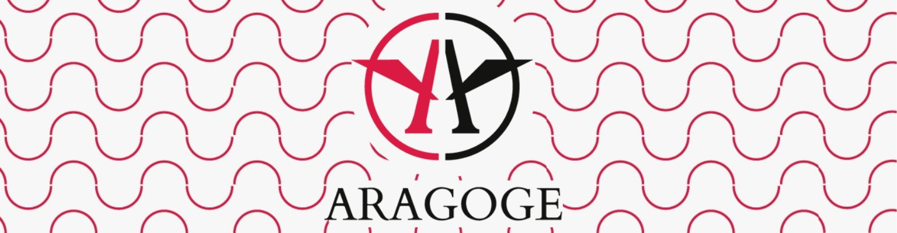

<main style="max-width:800px; margin:auto;">
<h1 style="text-align:center;">Aragoge - Backend</h1>


Este repositorio contiene el backend del proyecto Aragoge, desarrollado como parte de la tesis de la carrera de Diseño y Programación Web en la Escuela Da Vinci. El proyecto es una colaboración entre Abraham Bartoloni (Backend) y Ezequiel Arevalo (Frontend).

Para acceder al repositorio del frontend, visita el siguiente enlace:[Repositorio del Frontend.](https://github.com/ezequiel-arevalo/aragoge-frontend)


# Objetivo de la plataforma
Aragoge tiene como misión crear un punto de encuentro entre atletas y profesionales del deporte, facilitando la contratación de entrenadores, preparadores físicos, nutricionistas y terapeutas que se ajusten a las necesidades de los atletas. Al mismo tiempo, la plataforma ofrece a los profesionales del deporte la oportunidad de crecer profesionalmente, expandiendo su base de clientes y gestionando sus servicios desde un único lugar.

# Responsabilidades de cada desarrollador de "Aragoge"
El desarrollo de Aragoge ha sido llevado a cabo por dos personas, quienes han asumido responsabilidades más allá de la escritura de código.

## Abraham Bartoloni:
- Elección del nombre de la marca.
- Diseño de la base de datos SQL.
- Creación del logo.
- Planificación de la promoción y evento de lanzamiento de la marca.
- Desarrollo del backend.

## Ezequiel Arevalo
- lección del nombre de la marca.
- Definición de tipografías, colores y decisiones gráficas generales.
- Diseño de las vistas.
- Desarrollo del merchandising.
- Desarrollo del frontend web.

# Tecnologías y herramientas utilizadas (Backend)
- Laravel 11: Framework utilizado para la construcción de la API.
- Sanctum: Sistema de autenticación y generación de tokens para usuarios.
- MySQL: Sistema de gestión de bases de datos relacional utilizado para almacenar y gestionar la información.
- intervention/image-laravel: Manipulacion y manejo de imágenes.

# Instalacion y configuracion

> **IMPORTANT**  
> Requisitos previos:
> - PHP 8.x
> - Composer
> - MySQL
> - [Laravel 11](https://laravel.com/)

1. Clona el repositorio
``` Bash
git clone https://github.com/Bartoloni00/aragoge-backend.git
``` 

2. Navega hasta el directorio del proyecto:
``` Bash
cd aragoge-backend
``` 

3. En caso de que no tengas las carpetas "storage/app/public/planning" y "storage/app/public/users", crealas
``` Bash
mkdir storage/app/public/plannings
mkdir storage/app/public/users
```

4. Instala todas las dependencias del proyecto
``` Bash
composer install
``` 

5. Corre las migraciones y los seeders, generando la base de datos y cargando algunos datos
``` Bash
php artisan migrate
``` 
``` Bash
php artisan db:seed
``` 

6. En caso de que no se haya generado la APP_KEY en el archivo ".env" lanza el siguiente comando
``` Bash
php artisan key:generate
``` 

7. Despliega la API
``` Bash
php artisan serve
``` 

8. En caso de que ya tengas creada la base de datos y quiera restaurarla, ejecuta el siguiente comando:
``` Bash
php artisan migrate:fresh --seed
```
> [!INFO]
>
> La documentacion de la API se encuentra en el archivo [API.docs.md](https://github.com/Bartoloni00/aragoge-backend/blob/main/API.docs.md)
</main>